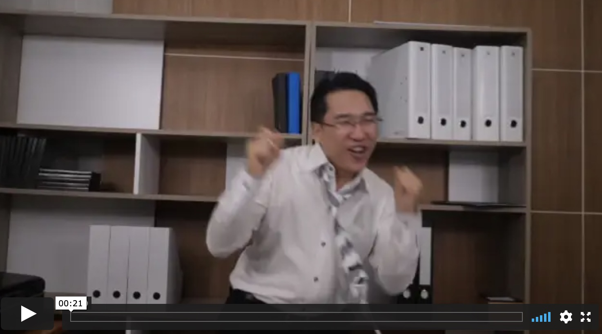

# SAMBAL (video tempo detection)

This repo is kernel of an attept to build out a way to detect tempo / bpm from video clips. (Haven't you ever wanted to automagicallly score your movies? This would help towards that.) This code parses video and builds an optical flow using [openCV](https://github.com/opencv/opencv) Farneback algorithm for dense optical flow. Then we calculate the angle between the movement vectors to extract a way of representing motion to infer beats and tempo using Ryan Faircloth's visual tempo detection algorithm. 

For example, when run on the following video, we infer the tempo as 128bpm. Overlay some music, and huzzah! 

[](https://vimeo.com/486155900 "Tempo Detection")

This is just a quick implementation to quickly explore the problem and prototype a solution. Obvious next steps are CNN or LSTM based on these timeseries representations of movement. 

## How to run
```python
python3 run.py ~/Documents/tempo_videos/p_vid.mp4
```